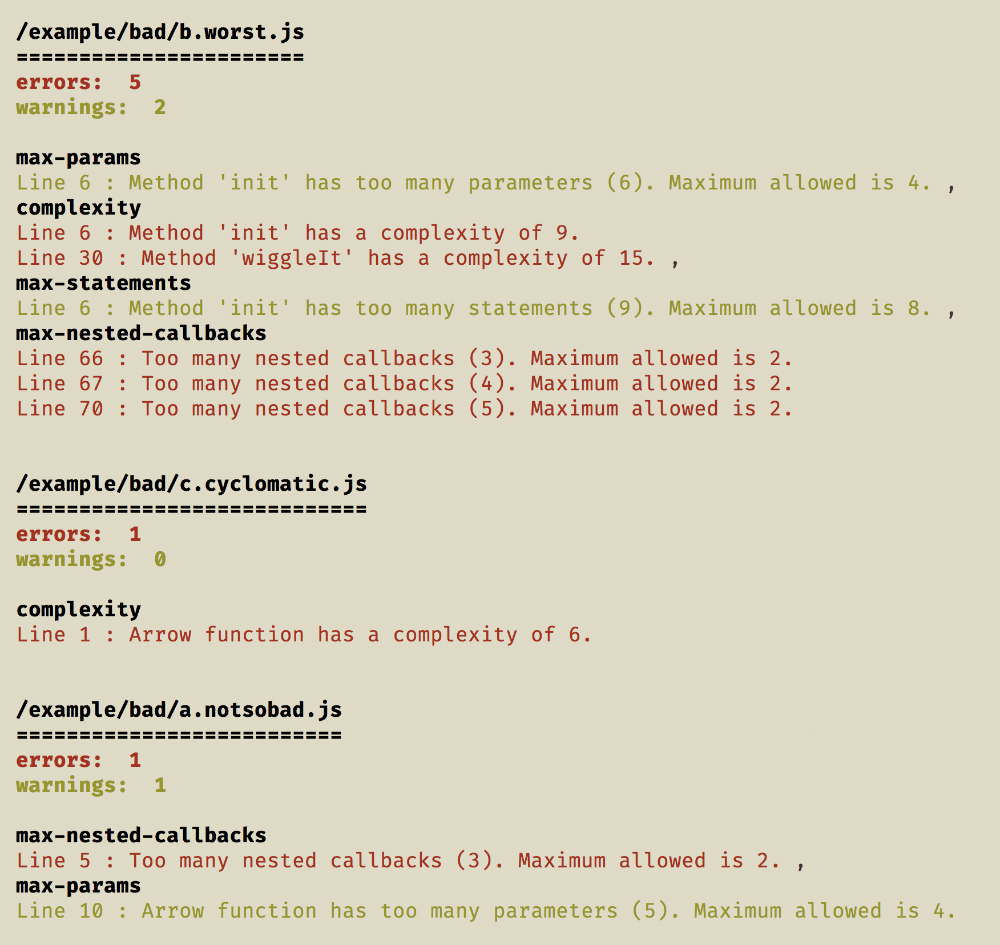

[](https://app.fossa.io/projects/git%2Bgithub.com%2Fmlennox%2Feslint-formatter-complexity?ref=badge_shield)

# eslint-formatter-complexity

This is an eslint formatter that generates an ordered list of the most complex files in your codebase.

[](https://circleci.com/gh/mlennox/eslint-formatter-complexity/tree/master)

## Installation and usage

To install `eslint-formatter-complexity`

```bash
npm install --save-dev eslint-formatter-complexity
```

### Running on CLI

The easiest way to execute the formatter from the CLI is using `npx`

```bash
# run eslint on current directory using the `eslint-formatter-complexity` formatter
npx eslint -f complexity .
```

One alternate method that will work on the CLI is

```bash
./node_modules/.bin/eslint -f complexity .
```

### As an npm script

Use the following configuration in your `package.json`. The optional trailing ` || true` will swallow any errors generated by `eslint`, it is not necessary to include this.

```javascript
{
    "scripts": {
        "complex": "eslint -f complexity . || true"
    }
}
```

You can run the following command on the CLI

```bash
npm run complex
```

## Example output

The output below is the result of running `npx eslint -f ./src/index.js .` in this repo.



## What is it all about?

ESlint provides a number of rules that measure the complexity of javascript code. This formatter uses the results of an eslint execution, taking the list of files that have violated complexity rules in some way, and ordering them depending on how many errors and/or warnings are generated for each file.

You will need to configure eslint to check at least one of the following complexity rules.

- [complexity](https://eslint.org/docs/rules/complexity)
- [max-params](https://eslint.org/docs/rules/max-params)
- [max-statements](https://eslint.org/docs/rules/max-statements)
- [max-statements-per-line](https://eslint.org/docs/rules/max-statements-per-line)
- [max-nested-callbacks](https://eslint.org/docs/rules/max-nested-callbacks)
- [max-depth](https://eslint.org/docs/rules/max-depth)
- [max-lines](https://eslint.org/docs/rules/max-lines)

An example rules section for `.eslintrc.js` is shown below - you should adjust the rule configuration to suit your team.

```javascript
{
    "rules": {
        'complexity': ['warn', 8],
        'max-params': ['warn', 4],
        'max-statements': ['warn', 10],
        'max-statements-per-line': [
            'error',
            {
                max: 1,
            },
        ],
        'max-nested-callbacks': ['warn', 2],
        'max-depth': [
            'warn',
            {
                max: 2,
            },
        ],
        'max-lines': ['warn', 80],
    },
}
```

### Cyclomatic complexity

Any errors or warnings that are generated as a result of cyclomatic complexity - the eslint rule, `complexity` - are weighted with a higher importance, pushing any files

## Configuration

This initial version has no configuration options. In future releases it is planned to add configuration that will allow you to

1. choose list of rules that will be used to order the files
2. output list in different formats : plain text, JSON, and possibly HTML
3. limit the number of files reported ie. top 5 complex files instead of every file

In theory, the first configuration option would allow you to sort the files by violation of _any_ eslint rule, not just complexity oriented rules.

## Enhancement requests or filing bugs / issues

Please open an issue on the github repo, marking it as a [bug](https://github.com/mlennox/eslint-formatter-complexity/labels/bug), [enhancement](https://github.com/mlennox/eslint-formatter-complexity/labels/enhancement), or you can ask a [question](https://github.com/mlennox/eslint-formatter-complexity/labels/question)

## License

[](https://app.fossa.io/projects/git%2Bgithub.com%2Fmlennox%2Feslint-formatter-complexity?ref=badge_large)